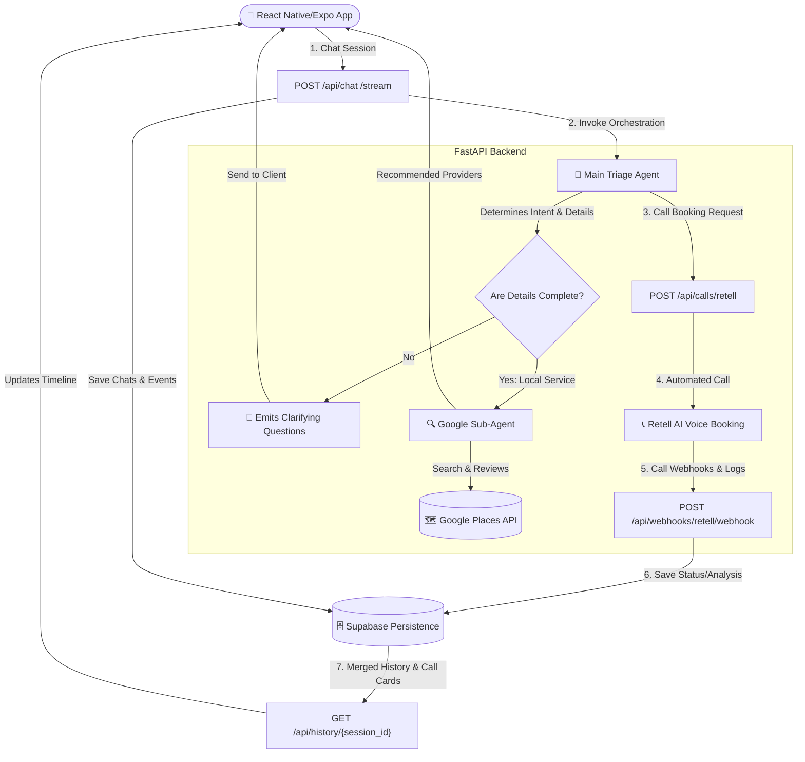

# Agentic Service Orchestrator 🤖

[](https://ai-service.sheikhshaheer.dev/)
[](https://fastapi.tiangolo.com)
[](https://python.langchain.com)
[](https://expo.dev)
[](LICENSE)

An intelligent, conversational AI platform designed to automate local service discovery, triage, and booking orchestration. Built on a powerful multi-agent architecture and styled with an ultra-premium glassmorphic dark-mode mobile experience, this system bridges the gap between text-based human intent and real-world provider coordination.

---

## 🏗️ Architecture Overview

The system utilizes an advanced **triage-and-routing agent network** designed with LangChain and LangGraph, running alongside a responsive React Native/Expo mobile app:



---

## ✨ Key Features & Benefits

* **Intelligent Conversational Triage**: Parses human language requests, automatically extracts parameters (location, service type, preferred date/time), and dynamically issues structured clarifying questions if info is missing.
* **Dual-Mode High-Performance API**: Supports both block-level JSON responses and real-time token and sub-step event streaming using Server-Sent Events (SSE).
* **Autonomous Local Search**: Incorporates a sub-agent utilizing Google Maps/Places API to query local businesses, retrieve user ratings, scrape reviews, and formulate top 3 recommended options.
* **Automated Telephony Bookings**: Integrates Retell AI to automatically execute outbound voice-call booking requests directly to service providers, analyzing transcripts to record confirmation status.
* **Dynamic Conversational Memory**: Transparently tracks long chat histories and automatically triggers context-aware LLM-based summarization to conserve context window limits.
* **Unified Developer Environment**: Provides full CI/CD deployment automation utilizing GitHub Actions for production web server hosting and AWS EC2 updates.

---

## 🚀 Getting Started

### Prerequisites

* **Node.js**: `v22.x` or later
* **Python**: `3.11` or `3.12`
* **Google Cloud Project** (or an authorized Google Gemini API Key)
* **Supabase** account and database
* **Retell AI** account (for telephony features)

---

### 1. Database Setup

The backend utilizes **Supabase** to store sessions, messaging history, and telephony webhooks.

1. Navigate to your Supabase SQL Editor.
2. Open and copy the contents of the database schema script: [backend/supabase_schema.sql](backend/supabase_schema.sql).
3. Run the script to create the required tables, indexes, and Row-Level Security (RLS) policies.

---

### 2. Backend Setup (FastAPI)

1. Move to the backend folder:
   ```bash
   cd backend
   ```
2. Create and activate a Python virtual environment:
   ```bash
   python -m venv .venv
   # On Windows (PowerShell):
   .venv\Scripts\Activate.ps1
   # On macOS/Linux:
   source .venv/bin/activate
   ```
3. Install required libraries:
   ```bash
   pip install -r requirements.txt
   ```
4. Copy the environment template and populate it with your API credentials:
   ```bash
   cp app/.env.example app/.env
   ```

#### 🔑 Backend Environment Variables

In your `backend/app/.env` file, configure the following keys:

| Environment Variable | Description | Required / Optional |
| :--- | :--- | :--- |
| `GEMINI_API_KEY` | Google Gemini API Authentication Key. | **Required** (If not using Vertex AI) |
| `GOOGLE_CLOUD_PROJECT` | Google Cloud/Vertex project ID for enterprise LLM access. | Optional |
| `GOOGLE_MAPS_API_KEY` | Google Places/Maps API key for local searches. | Optional (Falls back to mock data) |
| `GOOGLE_CALENDAR_API_KEY` | Google Calendar API for Google Calender reminder integeration. | Optional (Falls back to mock data) |
| `SUPABASE_URL` | Your Supabase database endpoint URL. | Optional (Skips persistence if empty) |
| `SUPABASE_SERVICE_ROLE_KEY` | Supabase service role key for backend database writes. | Optional (Skips persistence if empty) |
| `RETELL_API_KEY` | Retell AI telephony authentication key. | Optional (Disables calling if empty) |
| `RETELL_AGENT_ID` | Retell Agent template ID for voice booking. | Optional |
| `RETELL_FROM_NUMBER` | Retell-owned outbound dialing number. | Optional |

5. Run the FastAPI development server:
   ```bash
   python -m uvicorn app.main:app --host 0.0.0.0 --port 8000 --reload
   ```

The backend API documentation will be available locally at [http://localhost:8000/docs](http://localhost:8000/docs).

---

### 3. Frontend Setup (React Native / Expo)

The frontend is a universal cross-platform mobile application powered by **Expo**.

1. Move to the frontend folder:
   ```bash
   cd app
   ```
2. Install npm modules:
   ```bash
   npm install
   ```
3. Set up the local environment variables. Create a `.env` file inside the `app` directory:
   ```env
   EXPO_PUBLIC_API_URL=http://localhost:8000/api
   EXPO_PUBLIC_SUPABASE_URL=https://your-supabase-project.supabase.co
   EXPO_PUBLIC_SUPABASE_ANON_KEY=your-supabase-anon-key
   ```
4. Start the Expo development server:
   ```bash
   # Run local web server
   npm run web
   # Or run generic expo terminal (for iOS/Android simulator)
   npx expo start
   ```

---

## 🧪 Running Tests

To verify JWT verification, CORS settings, rate limiting, and core endpoint structures, you can run the localized python-based integration test suite.

1. Ensure the FastAPI backend is running locally on port `8000`.
2. Run the test command from the root of the workspace:
   ```bash
   python test_api.py
   ```

---

## 🛠️ Telephony Integration (Webhooks)

To handle automated phone bookings and record real-time call confirmation events, you must link your telephony provider to the backend:

1. Configure your Retell AI outbound telephony numbers.
2. Set the Retell webhook URL to point to your deployed backend route:
   ```
   https://your-api-domain.com/api/webhooks/retell/webhook
   ```
3. The backend will automatically handle signatures, parse call recordings/transcripts, create status update cards, and insert them directly into the active chat session.

---

## 🛡️ License

This project is licensed under the MIT License. See the [LICENSE](LICENSE) file for the full copyright statement.
